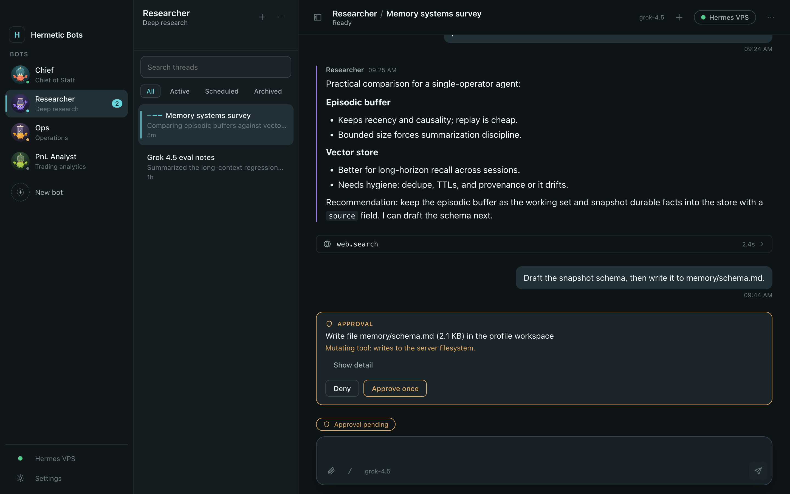

<div align="center">


# Hermetic Bots

**A private desktop control room for your Hermes Agent personas.**

Hermes underneath, hermetically sealed over SSH — hence the crab in the jar.

</div>

<div align="center">



</div>

## What it is

Hermes Agent runs on your own VPS. Its dashboard stays bound to the server's
loopback interface, which is exactly where it should be — and exactly why it is
awkward to reach. Hermetic Bots is a macOS app that opens an SSH tunnel to it,
then gives every Hermes profile a face, a persistent thread list, and a live
work log.

You never open a terminal to talk to your agents, and you never expose a port to
the internet to make that possible.

- **Every profile is a bot.** Name, role, and a generated crab-in-a-jar avatar —
  5 jar shapes × 4 eye styles × 2 poses × 10 palettes, so no two look alike. Or
  upload a picture.
- **A work log, not a chat toy.** Streamed replies, tool calls with expandable
  input/output, context-compaction markers, and system events in one
  chronological transcript.
- **Approvals in place.** Approval, clarification, sudo-password, and secret
  requests render as first-class transcript panels. Enter never approves
  anything.
- **Creating a bot takes two fields.** A name and a role. The Hermes profile id
  is derived, the avatar is derived, the model is inherited from whatever the
  server is authenticated for.
- **258 ready-made personas**, searchable by division, reshaped into the SOUL.md
  section format Hermes documents.
- **Telegram per persona.** Configure, test, and restart each profile's gateway;
  tokens go straight to Hermes and are never shown again.
- **Health you can read.** SSH, tunnel, Hermes, and gateway status are reported
  separately, so you know which layer is broken.

## Security model

The short version — the long version is in [`docs/SECURITY.md`](docs/SECURITY.md).

| | |
|---|---|
| **Transport** | System OpenSSH, spawned as an argv array. Local forward binds `127.0.0.1` only. Never `StrictHostKeyChecking=no`; changed host keys are refused outright. |
| **Renderer** | Sandboxed, context-isolated, no Node. A strict CSP, blocked navigation, and no remote resource loading. |
| **IPC** | A fully enumerated, zod-validated API. No generic invoke, fetch, path, or exec bridge — even picking an avatar happens through a main-process dialog so the renderer never names a file. |
| **Untrusted output** | Model and tool output render through a Markdown component that never parses HTML, so script injection is structurally impossible. Links require a click and show their hostname. |
| **Secrets** | SSH keys, Telegram tokens, sudo passwords, and secret responses never reach the renderer's state, disk, or logs. Everything logged passes through pattern and exact-value redaction. |
| **Exactly once** | Prompts and approvals carry one-time ids. A prompt whose delivery is unconfirmed is reconciled against history, never silently resent. |

Closing the app closes the tunnel. Hermes and your Telegram gateways keep
running on the server.

## Install

Requires macOS on Apple silicon, Node 20+, and an SSH key that already reaches
your VPS.

```bash
npm install
npm run package
```

Then drag `release/mac-arm64/Hermetic Bots.app` to `/Applications`. The build is
unsigned, so on another Mac you will need to right-click → Open once; shipping
it properly needs an Apple Developer ID, at which point re-enable
`hardenedRuntime` in `electron-builder.yml`.

On first launch, point it at your server. Authentication uses your existing
ssh-agent, a key file, or a `~/.ssh/config` alias — you are never asked to paste
a private key.

## Development

```bash
npm run dev         # run the app against your server
npm run typecheck   # main+preload and renderer projects
npm test            # unit suite
npm run mock-server # local Hermes REST + /api/ws stand-in
npm run personas    # re-vendor the persona library
npm run icon        # rebuild build/icon.icns from build/icon.svg
npm run screenshot  # regenerate docs/screenshot.png
```

**Demo mode.** Build, then serve `out/renderer` in a browser. With no preload
bridge present the app boots onto an in-memory stand-in with sample personas,
streaming, and an approval flow — which is how the screenshot above is
generated, and how the UI can be reviewed without touching a server.

## Compatibility

Built against **Hermes v0.20.4**. The app talks to the dashboard's REST API and
its `/api/ws` TUI gateway, and probes capabilities on connect so unsupported
features disable themselves rather than erroring. Version quirks live in the
Hermes adapter, not scattered through the UI.

It expects a **loopback** dashboard, where the SSH tunnel is the security
boundary. A gated (OAuth) deployment is detected and reported as unsupported
rather than half-working.

## Credits

The persona library is derived from
[agency-agents](https://github.com/msitarzewski/agency-agents) (MIT); SOUL
formatting follows [Hermes' own
guidance](https://hermes-agent.nousresearch.com/docs/user-guide/features/personality)
and the [Soul Spec](https://github.com/clawsouls/soulspec). Full notices in
[`THIRD-PARTY-NOTICES.md`](THIRD-PARTY-NOTICES.md).

Built from [`HERMES-BOTS-BUILD-SPEC.md`](HERMES-BOTS-BUILD-SPEC.md).
